# GucciLang Syntax

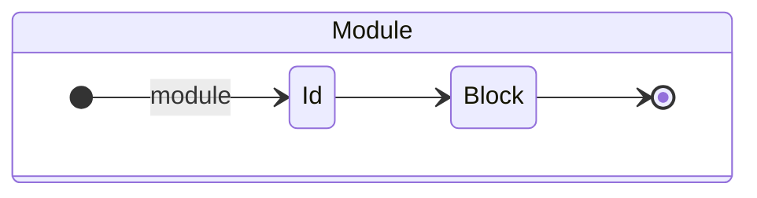

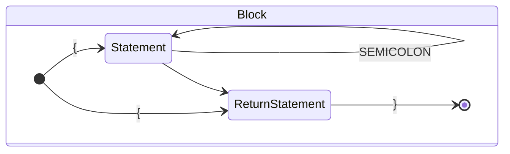

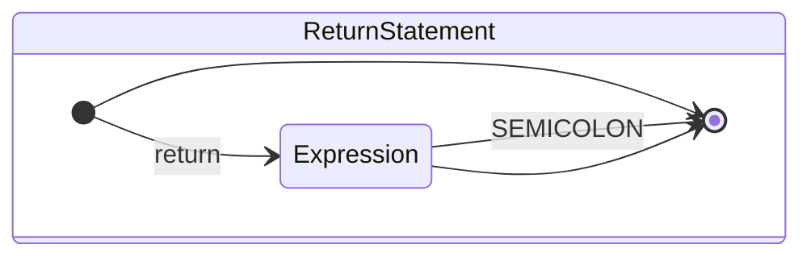

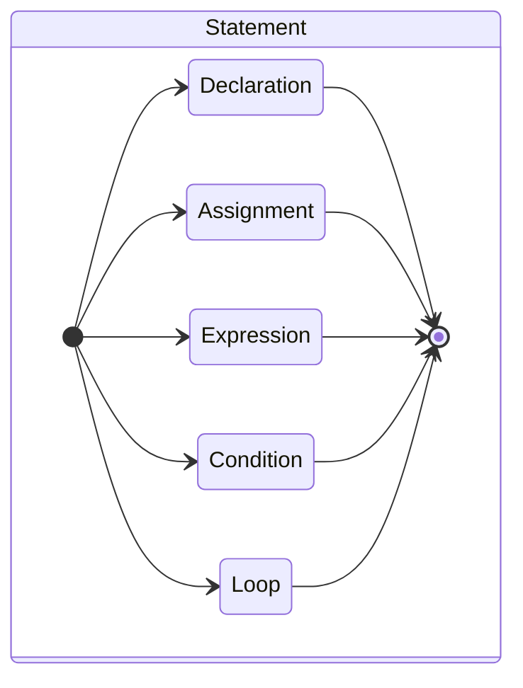


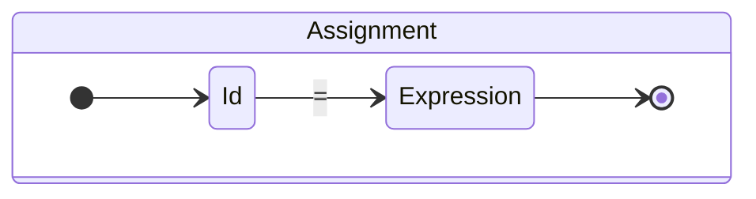

```mermaid
stateDiagram-v2
  state Condition {
    direction LR
    [*] --> Expression: if
    Expression --> Block
    Block --> [*]
    Block --> Expression: else if
    Block --> <Else>Block: else
    <Else>Block --> [*]
  }
```

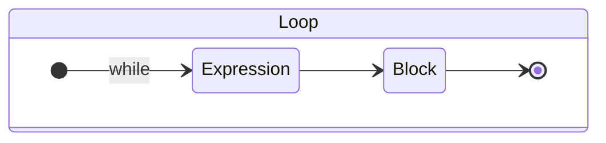

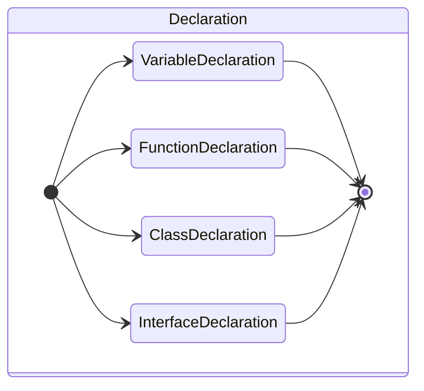

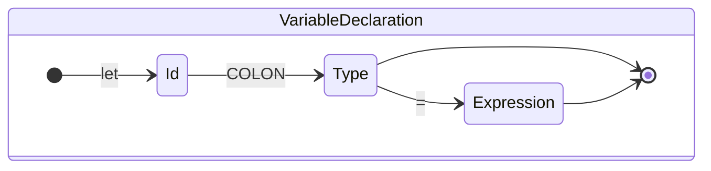

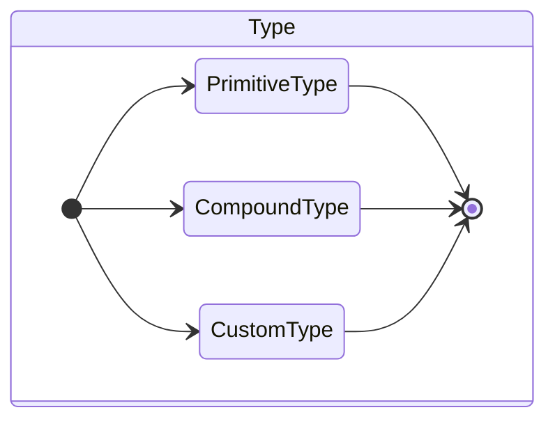

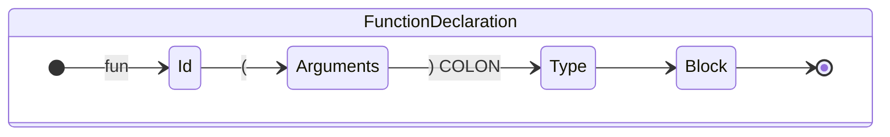

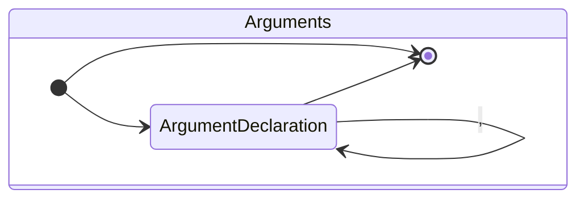

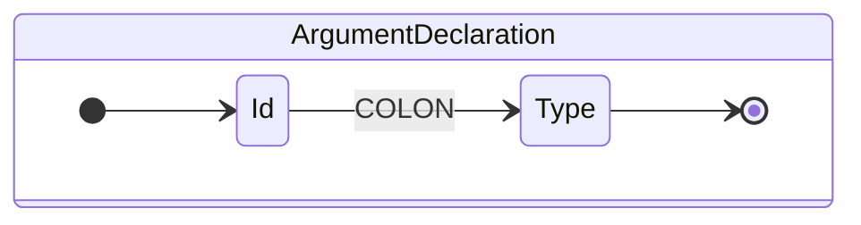

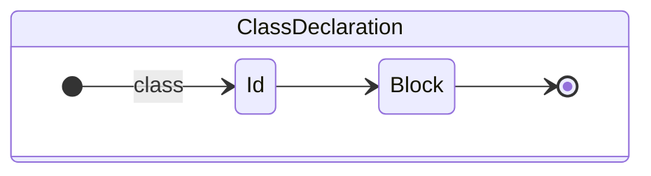

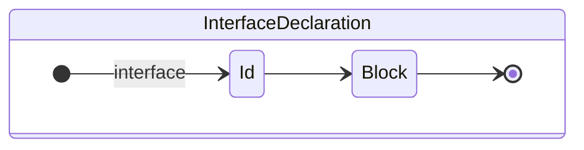


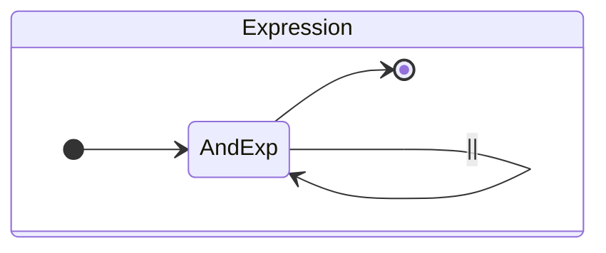

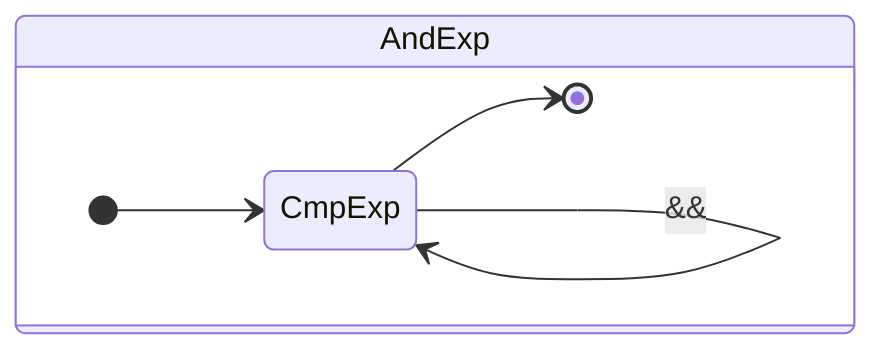

```mermaid
stateDiagram-v2
state CmpExp {
  direction LR
  [*] --> <left>TermExp
  <left>TermExp --> [*]
  <left>TermExp --> CmpOp
  CmpOp --> <right>TermExp
  <right>TermExp --> [*]
}
```

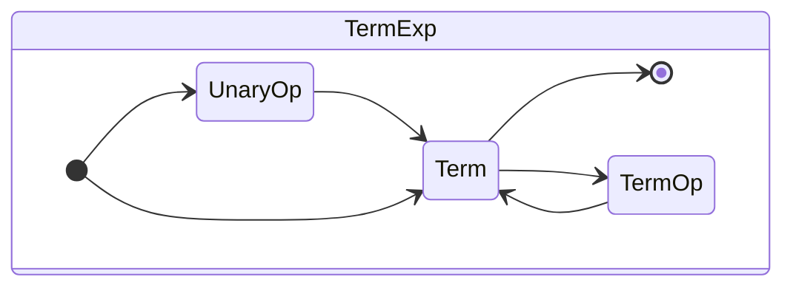

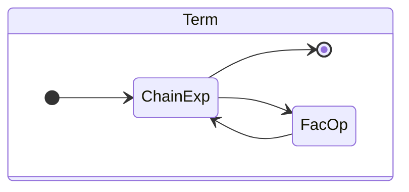

```mermaid
stateDiagram-v2
state Factor {
  direction LR
  [*] --> Expression: (
  Expression --> [*]: )
  [*] --> Constant
  Constant --> [*]
  [*] --> Id
  Id --> [*]
  [*] --> FunctionCall
  FunctionCall --> [*]
  [*] --> ChainExp
  ChainExp --> [*]
}
```

```mermaid
stateDiagram-v2
state FunctionCall {
  direction LR
  [*] --> Id
  Id --> (
  ( --> Expression
  ( --> )
  Expression --> Expression: ,
  Expression --> )
  ) --> [*]
}
```

```mermaid
stateDiagram-v2
state ChainExp {
  direction LR
  [*] --> Chain
  Chain --> [*]
  Chain --> Chain: .
}
```

```mermaid
stateDiagram-v2
state Chain {
  direction LR
  [*] --> Id
  Id --> [*]
  [*] --> FunctionCall
  FunctionCall --> [*]
}
```

```mermaid
stateDiagram-v2
state Constant {
  direction LR
  [*] --> Int
  Int --> [*] 
  [*] --> Float
  Float --> [*]
  [*] --> Bool
  Bool --> [*]
  [*] --> Char
  Char --> [*]
  [*] --> String
  String --> [*]
}
```

```mermaid
stateDiagram-v2
state CmpOp {
  direction LR
  [*] --> [*]: >
  [*] --> [*]: <
  [*] --> [*]: ==
  [*] --> [*]: >=
  [*] --> [*]: <=
  [*] --> [*]: !=
}
```

```mermaid
stateDiagram-v2
state TermOp {
  direction LR
  [*] --> [*]: +
  [*] --> [*]: -
}
```

```mermaid
stateDiagram-v2
state FacOp {
  direction LR
  [*] --> [*]: *
  [*] --> [*]: /
}
```

```mermaid
stateDiagram-v2
state UnaryOp {
  direction LR
  [*] --> [*]: !
  [*] --> [*]: -
}
```

```mermaid
stateDiagram-v2
state PrimitiveType {
  direction LR
  [*] --> [*]: int
  [*] --> [*]: float
  [*] --> [*]: bool
  [*] --> [*]: char
}
```

```mermaid
stateDiagram-v2
state CompoundType {
  direction LR
  [*] --> TupleType
  TupleType --> [*]
  [*] --> ArrayType
  ArrayType --> [*]
}
```

```mermaid
stateDiagram-v2
state TupleType {
  direction LR
  [*] --> Type: (
  Type --> [*]: )
  Type --> Type: ,
}
```

```mermaid
stateDiagram-v2
state ArrayType {
  direction LR
  [*] --> Type: [
  Type --> [*]: ]
}
```

```mermaid
stateDiagram-v2
state PrimitiveType {
  direction LR
  [*] --> [*]: int
  [*] --> [*]: float
  [*] --> [*]: bool
  [*] --> [*]: char
}
```